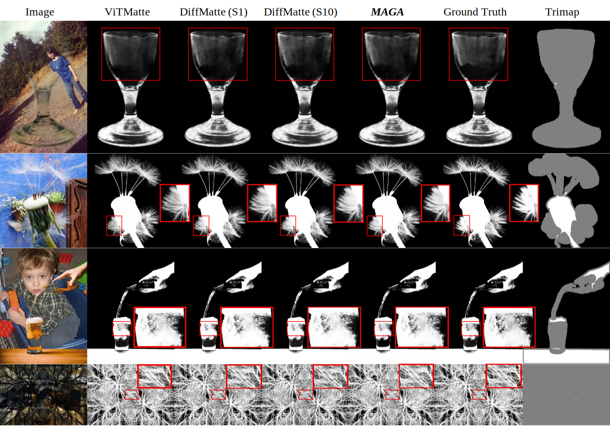

# *MAGA*

This is the official implementation of "***MAGA***: Morpho-Aware Global Attention for Image Matting"

### Data Preparation

#### Composite-1k

1. Get DIM dataset on [Deep Image Matting](https://sites.google.com/view/deepimagematting).
2. For DIM dataset preparation, please refer to [GCA-Matting](https://github.com/Yaoyi-Li/GCA-Matting).
   - For Training, merge 'Adobe-licensed images' and 'Other' folder to use all 431 foregrounds and alphas
   - For Testing, use 'Composition_code.py' and 'copy_testing_alpha.sh' in GCA-Matting.
3. For background images, Download dataset on [PASCAL](http://host.robots.ox.ac.uk/pascal/VOC/) and [COCO](https://cocodataset.org/#home).

#### Distinctions-646

1. The dataset link is : [Distinctions-646](https://drive.google.com/file/d/1ljJkWONPfJzylkZg_1HaGRoaRaaiAxRu/view?usp=sharing).
2. The trimap generated by [trimap_build_batch.py](https://github.com/kingbackyang/Morpho-Aware-Global-Attention-for-Image-Matting/blob/main/trimap_build_batch.py).

### +Acknowledge

Our work is based on [ViTMatte](https://github.com/hustvl/ViTMatte/tree/main), and we thank them for their outstanding work. We have extended the model by incorporating our own modifications, as well as providing the complete training and testing code for the Composite-1k and Distinction-646 datasets.